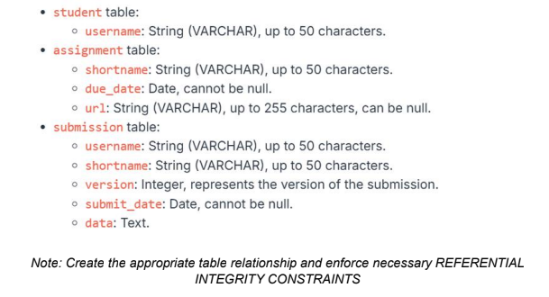

## Final Lab Task 2 : Transforming ER Model to Relational Tables

## Task Description: 
Given the ER diagram representing student assignment submissions, convert it into MySQL
tables. Capture all entities and their attributes, and define the relationships between students,
submissions, and assignments. Identify the primary and foreign keys and ensure proper representation of any dependent or weak entities.  

## REQUIRED OUTPUT
## STEP 1:
- Open XAMPP and start the Apatche and MySQL then open MySQL workbench
- Add a new connection
- Click the connection made
## STEP 2:
- Create a DATABASE BY using  
 `CREATE DATABE database_name`
- Use the database that has created by using  
  `USE database_name`
### Type the following data types attributes

- Creating Student Table  
`CREATE TABLE student_tbl(username VARCHAR(50)PRIMARY KEY NOT NULL UNIQUE);`
#### TABLE STRUCTURE

- Creating Submission Table  
` username VARCHAR(50), FOREIGN KEY (username) REFERENCES student_tbl(username), shortname VARCHAR(50), FOREIGN KEY(shortname) REFERENCES assignment_tbl(shortname) ON DELETE CASCADE
ON UPDATE CASCADE, version INT NOT NULL, submit_date DATE NOT NULL, data TEXT, PRIMARY KEY(username, shortname, version));`
#### TABLE STRUCTURE

- Creating Assignment Table  
`CREATE TABLE assignment_tbl (shortname  VARCHAR(50) NOT NULL PRIMARY KEY , due_date DATE NOT NULL, url VARCHAR(255) UNIQUE);`
#### TABLE STRUCTURE

### HERE IS THE ER Diagram OR Relational schema

#### HERE IS THE MYSQL FILE
[Student Table](file/assignment_submission_db_student_tbl.sql)  
[Submission Table](file/assignment_submission_db_submission_tbl.sql)  
[Assignment Table](file/assignment_submission_db_assignment_tbl.sql)  
